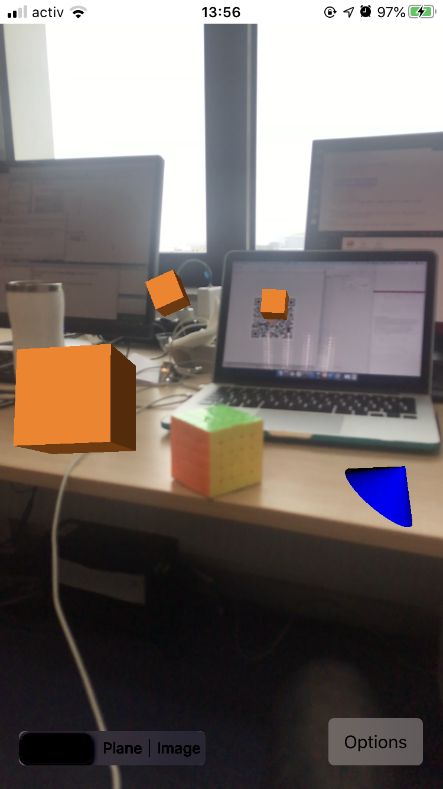
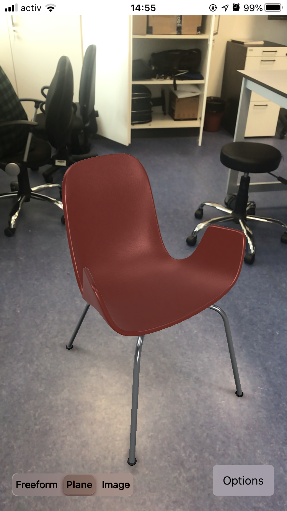
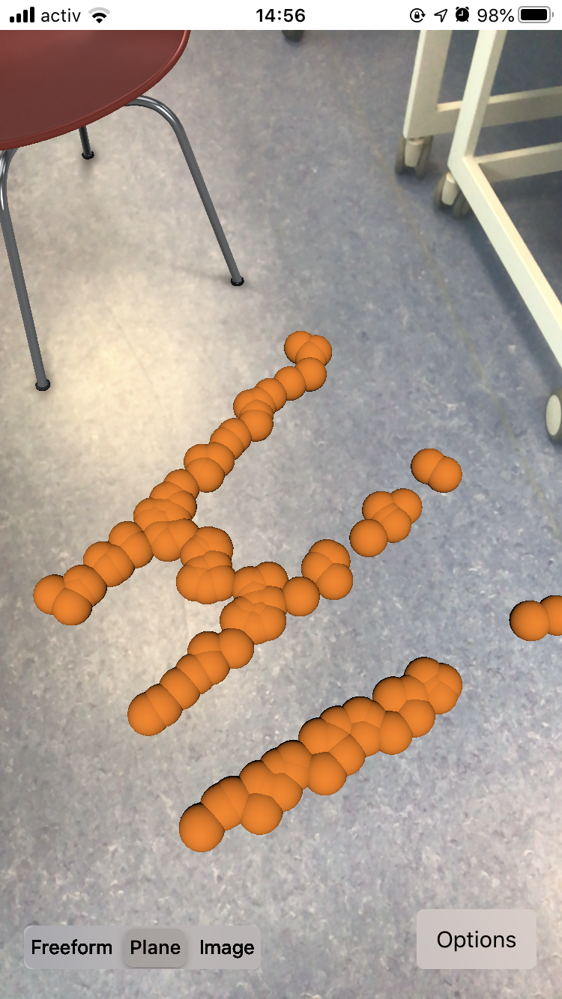

# ARKit-Drawing

This is a 3D drawing application that employs:

* Multiple MVCs
* ARKit

Modes:

* Image recognition
* Horizontal plane recognition
* Freeform model addition

### App Screenshots

  

Freeform

  
  

Horizontal plane
